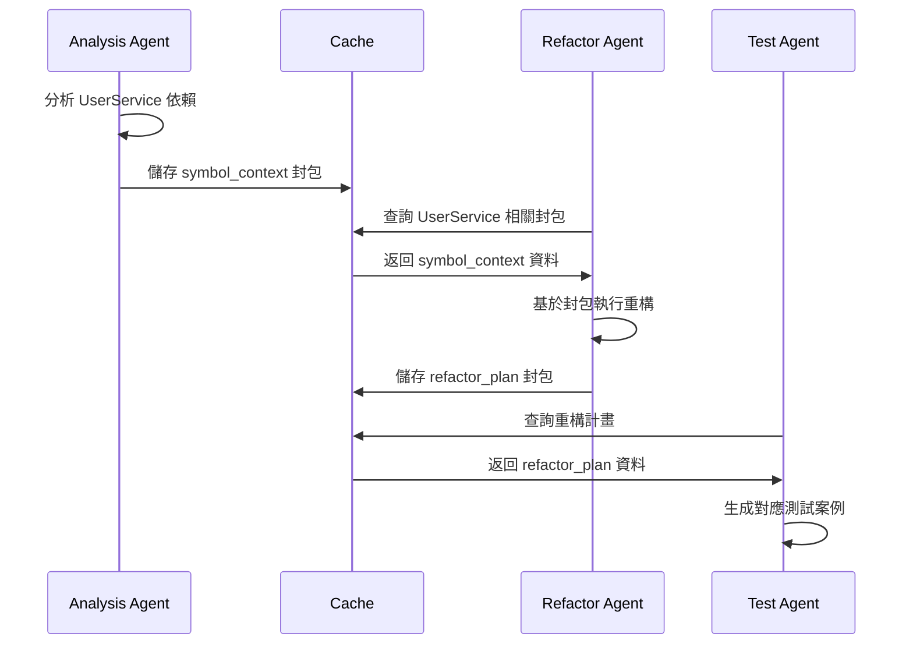

# 跨 AI 傳遞協定 | Cross-AI Communication Protocol

## 協定概述 | Protocol Overview

本協定定義 AI agents 間如何安全、高效地傳遞程式碼上下文資訊，基於 `code_context_packet_v1` 標準實現知識共享與協作。

## 核心原則 | Core Principles

### 1. 結構化傳遞 | Structured Transfer
- 所有資訊必須符合 JSON Schema 規範
- 包含完整的來源追蹤與時間戳記
- 提供人類可讀的摘要與 AI 指示

### 2. 安全性優先 | Security First  
- 不傳遞敏感資訊（API keys、密碼、個人資料）
- 包含資料完整性驗證機制
- 支援存取控制與權限管理

### 3. 版本相容性 | Version Compatibility
- 向下相容舊版本封包格式
- 明確標示不相容的變更
- 提供遷移指南與工具

## 傳遞機制 | Transfer Mechanisms

### 機制 1：檔案系統快取 | File System Cache

**適用場景：** 同一專案內的 AI agents 協作

```typescript
// 標準快取路徑
const CACHE_PATH = '.gitnexus/ai-context-cache/';

// 儲存封包
export async function storePacketToCache(packet: CodeContextPacket): Promise<void> {
  const filename = `${packet.context_type}_${packet.packet_id}.json`;
  const filepath = path.join(CACHE_PATH, filename);
  
  await fs.mkdir(CACHE_PATH, { recursive: true });
  await fs.writeFile(filepath, JSON.stringify(packet, null, 2));
  
  // 更新索引檔案
  await updateCacheIndex(packet);
}

// 檢索封包
export async function loadPacketFromCache(
  contextType: ContextType,
  query?: string
): Promise<CodeContextPacket[]> {
  const indexPath = path.join(CACHE_PATH, 'index.json');
  const index = JSON.parse(await fs.readFile(indexPath, 'utf-8'));
  
  return index.packets
    .filter(p => p.context_type === contextType)
    .filter(p => !query || isQueryMatch(p, query))
    .map(p => loadPacketFile(p.filename));
}
```

### 機制 2：記憶體共享 | Memory Sharing

**適用場景：** 同一 session 內的多個 AI 工具

```typescript
// 全域記憶體儲存
const MEMORY_STORE = new Map<string, CodeContextPacket>();

export class ContextMemoryManager {
  static store(packet: CodeContextPacket): void {
    const key = this.generateKey(packet);
    MEMORY_STORE.set(key, packet);
    
    // 設定 TTL（存活時間）
    setTimeout(() => {
      MEMORY_STORE.delete(key);
    }, 30 * 60 * 1000); // 30 分鐘
  }
  
  static retrieve(
    contextType: ContextType, 
    symbolName?: string
  ): CodeContextPacket[] {
    return Array.from(MEMORY_STORE.values())
      .filter(p => p.context_type === contextType)
      .filter(p => !symbolName || this.matchesSymbol(p, symbolName))
      .sort((a, b) => new Date(b.timestamp).getTime() - new Date(a.timestamp).getTime());
  }
  
  private static generateKey(packet: CodeContextPacket): string {
    return `${packet.repository.name}:${packet.context_type}:${packet.packet_id}`;
  }
}
```

### 機制 3：HTTP API 傳遞 | HTTP API Transfer

**適用場景：** 跨專案或遠端 AI agents

```typescript
// API 端點定義
export class ContextAPIServer {
  // 上傳封包
  @POST('/api/v1/context/packets')
  async uploadPacket(@Body() packet: CodeContextPacket): Promise<{id: string}> {
    // 驗證封包格式
    if (!validatePacket(packet)) {
      throw new BadRequestException('Invalid packet format');
    }
    
    // 安全性檢查
    if (containsSensitiveData(packet)) {
      throw new ForbiddenException('Packet contains sensitive data');
    }
    
    const id = await this.contextService.store(packet);
    return { id };
  }
  
  // 查詢封包
  @GET('/api/v1/context/packets')
  async queryPackets(
    @Query('type') contextType: ContextType,
    @Query('repo') repository: string,
    @Query('query') query?: string
  ): Promise<CodeContextPacket[]> {
    return await this.contextService.query({
      contextType,
      repository,
      query,
      limit: 50
    });
  }
}
```

## 協作工作流程 | Collaboration Workflows

### 工作流程 1：分析 → 重構 → 測試



### 工作流程 2：多 AI 協同除錯

```typescript
// 除錯協作範例
export async function collaborativeDebugging(errorMessage: string) {
  // Agent 1: 錯誤分析
  const errorAnalysis = await analyzeError(errorMessage);
  const analysisPacket = createContextPacket(
    'search_results',
    errorAnalysis,
    `debug: ${errorMessage}`,
    'debug'
  );
  await storePacketToCache(analysisPacket);
  
  // Agent 2: 影響評估
  const impactPackets = await loadPacketFromCache('search_results');
  const relevantSymbols = extractSymbolsFromPackets(impactPackets);
  
  for (const symbol of relevantSymbols) {
    const impactAnalysis = await analyzeImpact(symbol.name);
    const impactPacket = createContextPacket(
      'impact_analysis',
      impactAnalysis,
      `impact of ${symbol.name}`,
      'impact_assess'
    );
    await storePacketToCache(impactPacket);
  }
  
  // Agent 3: 修復建議
  const allPackets = await loadPacketFromCache('impact_analysis');
  const fixSuggestions = generateFixSuggestions(allPackets);
  
  return {
    analysis: analysisPacket,
    impacts: allPackets,
    suggestions: fixSuggestions
  };
}
```

## 品質保證 | Quality Assurance

### 1. 封包驗證檢查清單

```typescript
export interface PacketValidationResult {
  isValid: boolean;
  errors: string[];
  warnings: string[];
}

export function validatePacketQuality(packet: CodeContextPacket): PacketValidationResult {
  const result: PacketValidationResult = {
    isValid: true,
    errors: [],
    warnings: []
  };
  
  // 必要欄位檢查
  if (!packet.packet_id || !isValidUUID(packet.packet_id)) {
    result.errors.push('Invalid or missing packet_id');
  }
  
  // 時間戳記檢查
  const age = Date.now() - new Date(packet.timestamp).getTime();
  if (age > 24 * 60 * 60 * 1000) { // 24 小時
    result.warnings.push('Packet is older than 24 hours');
  }
  
  // 資料完整性檢查
  if (packet.context_type === 'symbol_context' && !packet.data.symbol) {
    result.errors.push('Missing symbol data for symbol_context type');
  }
  
  // 安全性檢查
  if (containsSensitivePatterns(JSON.stringify(packet))) {
    result.errors.push('Packet may contain sensitive information');
  }
  
  result.isValid = result.errors.length === 0;
  return result;
}
```

### 2. 效能監控

```typescript
export class ContextTransferMetrics {
  private static metrics = {
    packetsCreated: 0,
    packetsReused: 0,
    cacheHitRate: 0,
    averagePacketSize: 0,
    transferLatency: []
  };
  
  static recordPacketCreation(packet: CodeContextPacket): void {
    this.metrics.packetsCreated++;
    this.metrics.averagePacketSize = this.calculateAverageSize(packet);
  }
  
  static recordPacketReuse(): void {
    this.metrics.packetsReused++;
    this.updateCacheHitRate();
  }
  
  static getMetrics() {
    return {
      ...this.metrics,
      efficiency: this.metrics.packetsReused / this.metrics.packetsCreated,
      totalSavings: this.calculateTokenSavings()
    };
  }
}
```

## 故障處理 | Error Handling

### 常見問題與解決方案

| 問題 | 原因 | 解決方案 |
|------|------|----------|
| 封包格式錯誤 | Schema 不符 | 使用 `validatePacket()` 檢查 |
| 快取過期 | 程式碼已變更 | 檢查 commit hash，重新分析 |
| 記憶體不足 | 封包過大 | 實作分頁載入機制 |
| 權限拒絕 | 存取控制 | 檢查 agent 權限設定 |

### 降級策略

```typescript
export async function safeContextRetrieval(
  contextType: ContextType,
  fallbackQuery: string
): Promise<CodeContextPacket | null> {
  try {
    // 嘗試從快取載入
    const cached = await loadPacketFromCache(contextType);
    if (cached.length > 0) {
      return cached[0];
    }
  } catch (error) {
    console.warn('Cache retrieval failed:', error);
  }
  
  try {
    // 降級：重新執行查詢
    const freshData = await executeQuery(fallbackQuery);
    return createContextPacket(contextType, freshData, fallbackQuery, 'explore');
  } catch (error) {
    console.error('Fallback query failed:', error);
    return null;
  }
}
```

## 實作檢查清單 | Implementation Checklist

### Phase 1: 基礎實作
- [ ] 實作 `code_context_packet_v1` JSON Schema 驗證
- [ ] 建立檔案系統快取機制
- [ ] 實作基本的封包 CRUD 操作
- [ ] 加入安全性檢查（敏感資料過濾）

### Phase 2: 協作功能
- [ ] 實作記憶體共享機制
- [ ] 建立 HTTP API 端點
- [ ] 加入封包過期與清理機制
- [ ] 實作查詢與檢索功能

### Phase 3: 品質與監控
- [ ] 加入效能監控與指標收集
- [ ] 實作故障處理與降級策略
- [ ] 建立封包品質評估機制
- [ ] 加入使用分析與最佳化建議

這個協定為 AI agents 提供了標準化的知識傳遞機制，確保程式碼理解能夠高效、安全地在不同工具間共享。
