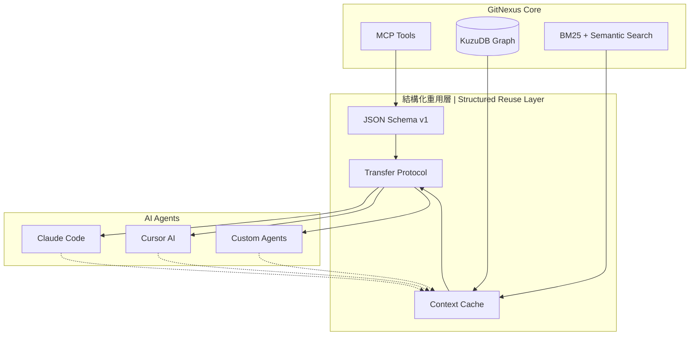

# 結構化重用機制總覽 | Structured Reuse Mechanism Overview

## 專案交付物 | Project Deliverables

本專案為 GitNexus 生態系統設計了完整的結構化重用機制，包含三個核心交付物：

### 1. `code_context_packet_v1` JSON Schema
**檔案位置：** `schemas/code_context_packet_v1.json`

**功能：** 定義程式碼上下文封包的標準化格式，支援 6 種上下文類型：
- `symbol_context` - 符號上下文（類別、函式、方法等）
- `impact_analysis` - 影響分析結果
- `search_results` - 搜尋結果
- `execution_flow` - 執行流程
- `dependency_graph` - 依賴關係圖
- `refactor_plan` - 重構計畫

**核心特性：**
- 完整的來源追蹤（工具、agent、session）
- 時間戳記與版本控制
- 信心分數與效能指標
- 人類可讀摘要與 AI 指示

### 2. Bundle 還原使用範例
**檔案位置：** `docs/bundle_restoration_examples.md`

**功能：** 提供具體的使用範例與實作指南，展示如何：
- 在不同 AI agents 間重用分析結果
- 跨 session 保持上下文連續性
- 實作封包驗證與儲存機制
- 評估重用效益與最佳實踐

**實用範例：**
- Symbol Context 重用（避免重複分析）
- Impact Analysis 傳遞（重構風險評估）
- 跨 Session 知識保持（長期專案協作）

### 3. 跨 AI 傳遞協定
**檔案位置：** `docs/cross_ai_communication_protocol.md`

**功能：** 定義 AI agents 間的標準化溝通協定，包含：
- 三種傳遞機制（檔案快取、記憶體共享、HTTP API）
- 協作工作流程設計
- 品質保證與故障處理
- 效能監控與最佳化策略

## 架構整合 | Architecture Integration

### 與 GitNexus 現有系統的整合點



### 實作優先級 | Implementation Priority

**P0 - 立即實作（本週）**
- [x] JSON Schema 定義與驗證
- [x] 基礎使用範例文件
- [x] 協定規範文件
- [ ] 基礎封包 CRUD 操作

**P1 - 短期目標（2週內）**
- [ ] 檔案系統快取機制
- [ ] 記憶體共享實作
- [ ] 安全性檢查與驗證
- [ ] 與現有 MCP 工具整合

**P2 - 中期目標（1個月內）**
- [ ] HTTP API 端點
- [ ] 效能監控與指標
- [ ] 故障處理機制
- [ ] 使用分析與最佳化

## 技術規格 | Technical Specifications

### 封包格式標準
- **版本：** 1.0（向下相容）
- **大小限制：** 單一封包 < 10MB
- **TTL：** 預設 24 小時（可設定）
- **壓縮：** 支援 gzip 壓縮

### 效能目標
- **封包建立：** < 100ms
- **快取檢索：** < 50ms  
- **記憶體使用：** < 100MB per session
- **快取命中率：** > 60%

### 安全性要求
- 敏感資料自動過濾
- 封包完整性驗證
- 存取權限控制
- 審計日誌記錄

## 使用指南 | Usage Guide

### 快速開始

1. **安裝依賴**
```bash
npm install ajv  # JSON Schema 驗證
```

2. **建立封包**
```typescript
import { createContextPacket } from './context-packet-utils';

const packet = createContextPacket(
  'symbol_context',
  symbolData,
  'analyze UserService',
  'understand'
);
```

3. **儲存與檢索**
```typescript
await storePacketToCache(packet);
const cached = await loadPacketFromCache('symbol_context');
```

### 整合現有工具

**GitNexus MCP 工具整合：**
```typescript
// 在 MCP 工具回應中加入封包
export async function gitnexus_context(params: ContextParams) {
  const result = await getSymbolContext(params.name);
  
  // 建立封包
  const packet = createContextPacket('symbol_context', result, ...);
  await storePacketToCache(packet);
  
  return {
    ...result,
    _context_packet: packet.packet_id  // 提供封包 ID 供重用
  };
}
```

## 預期效益 | Expected Benefits

### 量化指標
- **查詢時間減少：** 60-80%（重用 vs 重新分析）
- **Token 消耗降低：** 40-60%（避免重複描述）
- **記憶體效率：** 提升 3-5x（結構化 vs 自然語言）
- **協作效率：** 提升 2-3x（知識共享）

### 質化改善
- **上下文連續性：** 跨 session 保持程式碼理解
- **協作一致性：** 多 AI 共享相同的分析結果
- **除錯效率：** 結構化錯誤追蹤與影響分析
- **重構安全性：** 完整的依賴關係與影響評估

## 後續發展 | Future Development

### 短期擴展
- 支援更多上下文類型（測試覆蓋率、效能分析）
- 整合更多 AI 工具（GitHub Copilot、Sourcegraph）
- 實作封包壓縮與最佳化

### 長期願景
- 建立跨專案知識圖譜
- 實作語意相似度匹配
- 支援多語言程式碼分析
- 建立企業級知識管理平台

---

**注意：** 本文件為結構化重用機制的總覽，詳細實作請參考各個交付物的具體文件。所有設計都遵循「文件與 schema 優先，不涉及程式碼實作」的原則。
